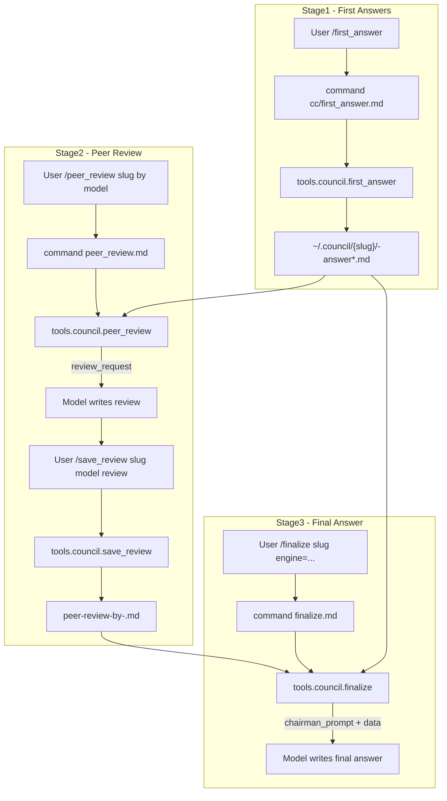

## LLM Council MCP Workflow

This document explains the end-to-end workflow and architecture of the `mcp-council` MCP server used in the `llm-council` project.

The system implements a 3‑stage council pattern:

- **Stage1 – First Answers**: Capture each model’s answer into `~/.council/{slug}/{model}-answer*.md`.
- **Stage2 – Peer Review**: Build a structured review prompt for another model to rank and critique answers, then save the review.
- **Stage3 – Final Answer**: Aggregate Stage1 + Stage2 into a “chairman” prompt for one model to synthesize the final answer.

---

## High-Level Architecture

- **Client layer (Cursor / Claude Code)**
  - Uses chat commands defined in `.cursor/commands/cc` or `~/.cursor/commands/cc`:
    - `first_answer` → Stage1 saver
    - `peer_review` + `save_review` → Stage2
    - `finalize` → Stage3
  - Commands are pure prompt+metadata and always call MCP tools for file I/O.

- **Server layer (`mcp-council` crate)**
  - Implements JSON-RPC MCP server in `src/mcp.rs`.
  - Exposes tools under the `council.*` namespace:
    - `council.first_answer`
    - `council.peer_review`
    - `council.save_review`
    - `council.finalize`
    - `council.summarize` (optional, for large documents)
    - `council.save_summary` (optional, saves summary)

- **Storage layer (`~/.council/` directory tree)**
  - Each conversation **slug** gets a directory `~/.council/{slug}/`.
  - Files are Markdown (with optional JSON compatibility paths for legacy use).

### Directory Layout

```text
~/.council/
  {slug}/
    <model>-answer.md
    <model>-answer-YYYYMMDD-HHMMSS.md
    summary.md                    # optional, for large documents
    summary-prompt.md             # optional, generated by summarize tool
    peer-review-by-<model>.md
    final-answer-by-<engine>.md   # optional, pattern for Stage3 output if used
```

### Workflow Overview



---

## Stage1 – First Answers (`council.first_answer`)

### Command: `first_answer` (Cursor)

Defined in `mcp-council/commands/cc/first_answer.md`.

- **Prerequisite**: ensure `~/.council` exists (home-scoped). Stage1 will create the slug directory under it.

- **Responsibility**: In each model tab, capture the current model’s full answer and delegate saving to the MCP tool.
- **Inputs**:
  - `title`: human-readable title, slugified to directory name.
  - `model`: (optional) inferred from tab name if not provided.
- **Behavior**:
  - Extract:
    - `title` → slug (lowercase, spaces → `-`, only `[a-z0-9-]`).
    - `model` → normalized model identifier (e.g. `sonnet`, `gpt-5-1`).
    - `prompt` → latest user question or context.
    - `content` → full text of the current model’s answer.
  - Call MCP tool:
    - `tools.council.first_answer` with `{ title, model, prompt, content }`.

### Tool: `council.first_answer`

Implemented in `src/tools/first_answer.rs`.

- **find_council_dir()**
  - Searches for `.council` starting from `env::current_dir()` up to 10 parent levels.
  - Falls back to `current_dir/.council` if not found.

- **handle_first_answer(params: Value) -> Result<Value>**
  - Validates required parameters: `title`, `prompt`, `content`.
  - Normalizes `model` or falls back to `"unknown-model"`.
  - Ensures directory: `.council/{title}` (creates if missing).
  - Sanitizes model name for filename:
    - Lowercase, keep `[a-z0-9_-]`, others become `-`.
  - Chooses filename:
    - First time: `{model}-answer.md`.
    - If exists: `{model}-answer-YYYYMMDD-HHMMSS.md`.
  - Writes Markdown:
    - Header fields: `- model:`, `- prompt:`, `- created_at:`.
    - Body: raw answer text (no trimming or summarization).
  - Returns JSON with `success`, `file_saved`, `summary`.

---

## Stage2 – Peer Review

Stage2 is intentionally split into:

- **`council.peer_review`** – build the review prompt and context.
- **`council.save_review`** – persist the review text as a Markdown file.

This separation keeps responsibilities clear and makes debugging easier.

### Command: `peer_review`

Defined in `commands/cc/peer_review.md`.

- Usage: `peer_review <slug> by <model>`.
- Extracts:
  - `title`: slug.
  - `model`: reviewer model name (e.g., `glm-4.6`).
  - `self_model`: same as `model` (current model’s own answer to be excluded).
- Calls MCP:
  - `tools.council.peer_review` with `{ title, model, self_model }`.

### Tool: `council.peer_review`

Implemented in `src/tools/peer_review.rs`.

- **Input**:
  - `title` (required)
  - `model` (reviewer model identifier)
  - `self_model` (model to exclude from review)

- **File discovery**:
  - Locate `~/.council/{title}` via `find_council_dir()`.
  - Collect all Stage1 answer files in that directory:
    - Files matching `*-answer.md`, `answer.md`, `*-answer.json`, `answer.json`.

- **Answer loading & filtering**:
  - Parse each answer via `read_stage1_answer(path)`:
    - If JSON, extract `model` and `response`.
    - If Markdown/plain, treat entire content as `response`; `model` from filename.
  - If `self_model` is set, skip any answer whose model matches `self_model` (case-insensitive).
  - Assign labels `Response A`, `Response B`, ... in order after exclusion.

- **User query extraction**:
  - Try to read one of:
    - `query.txt`, `user_query.txt`, `question.txt`, `input.txt` from slug directory.
  - Otherwise, scan an answer file:
    - JSON: `query` or `user_query` field.
    - Markdown: first line starting with `- prompt:`.
  - Fallback: `"Unknown query"`.

- **Review prompt creation**:
  - Builds a multi-part `review_request` string that includes:
    - The original question.
    - All labeled responses.
    - Instructions:
      - Evaluate each response individually.
      - Provide a `FINAL RANKING:` section in strict format.
      - Note that the current model’s own response is excluded.

- **Return payload**:

```json
{
  "success": true,
  "action": "perform_peer_review_and_save",
  "review_request": "<full prompt string>",
  "output_file": "peer-review-by-<sanitized-model>.md",
  "output_dir": "<absolute or relative directory string>",
  "instruction": "Please provide your peer review evaluation. When you're done, I'll save it to the specified file."
}
```

The calling model is expected to use `review_request` as its system/user prompt to generate the actual review text.

### Command: `save_review`

Defined in `commands/cc/save_review.md`.

- Usage:
  - `save_review <slug> <model> "Review content..."`
- Extracts:
  - `title` – slug.
  - `model` – reviewer model name.
  - `content` – review text.
- Calls MCP:
  - `tools.council.save_review` with `{ title, model, content }`.

### Tool: `council.save_review`

Implemented in `src/tools/save_review.rs`.

- **Input**:
  - `title` (required)
  - `model` (optional, with fallback rules)
  - `content` (required)

- **Behavior**:
  - Resolve `~/.council` base via `find_council_dir()`.
  - Ensure `~/.council/{title}` exists; error if missing.
  - Sanitize model for filename (similar logic to Stage1).
  - Build Markdown:

    ```markdown
    # Peer Review
    - title: {title}
    - model: {model}

    ## Review Content

    {content}
    ```

  - Write file: `.council/{title}/peer-review-by-{sanitized-model}.md`.
  - Return JSON indicating `file_saved` and a human-readable `summary`.

---

## Stage3 – Final Answer (`council.finalize`)

### Command: `finalize`

Defined in `commands/cc/finalize.md`.

- Usage:
  - `finalize <slug>`
  - `finalize <slug> engine=gemini`
- Extracts:
  - `title` – slug.
  - `engine` – target engine name (default `claude`).
- Calls MCP:
  - `tools.council.finalize` with `{ title, engine }`.

### Tool: `council.finalize`

Implemented in `src/tools/finalize.rs`.

- **Input**:
  - `title` (required)
  - `engine` (optional, default `"claude"`)

- **Stage1 loading**:
  - Enumerate Stage1 answer files in `~/.council/{title}` as in Stage2.
  - Parse each into:
    - `model`
    - `response`
    - `raw` (original content)

- **Stage2 loading**:
  - Enumerate files matching `peer-review*` in the same directory.
  - Parse each into:
    - `model` (reviewer)
    - `review` (text)
    - `raw`

- **User query extraction**:
  - Same strategy as `peer_review`:
    - Prefer dedicated `query.txt`-style files.
    - Fallback to answer file metadata.

- **Chairman prompt construction**:
  - Build `stage1_text`:
    - For each Stage1 result: `Model: <name>\nResponse: <text>`.
  - Build `stage2_text`:
    - For each review: `Model: <reviewer>\nRanking: <review text>`.
  - Build a single `chairman_prompt` string that:
    - Recaps original question.
    - Shows all Stage1 answers.
    - Shows all Stage2 rankings/reviews.
    - Asks the model (Chairman) to synthesize a single, comprehensive answer.

- **Return payload**:

```json
{
  "success": true,
  "action": "synthesize_final_answer",
  "data": {
    "title": "<slug>",
    "user_query": "<original question or derived query>",
    "stage1_results": [...],
    "stage2_results": [...],
    "engine": "<engine>",
    "chairman_prompt": "<full prompt text>"
  },
  "instruction": "As Chairman of the LLM Council, please synthesize all provided information into a comprehensive final answer to the user's question."
}
```

The IDE or client model then uses `chairman_prompt` as input to generate the final answer. If desired, a future enhancement could add a dedicated Stage3 saver tool mirroring `save_review`.

---

## Design Notes

- **Responsibility separation**
  - Stage1: capture and persist *individual* answers.
  - Stage2: prepare context and persist *peer reviews* separately.
  - Stage3: read existing artifacts and prepare a synthesis prompt; does not itself call an external LLM CLI.

- **Robust file discovery**
  - All tools rely on `find_council_dir()` to locate `.council` relative to the current working directory, allowing flexible project layouts.

- **Backward compatibility**
  - Both Stage1 and Stage2 loaders understand JSON answer/review formats for older workflows, while new flows prefer Markdown.

- **Safety and debuggability**
  - Each stage returns structured JSON with explicit `action` and `instruction` fields, making it easy for clients or humans to inspect and debug intermediate state without guessing.


